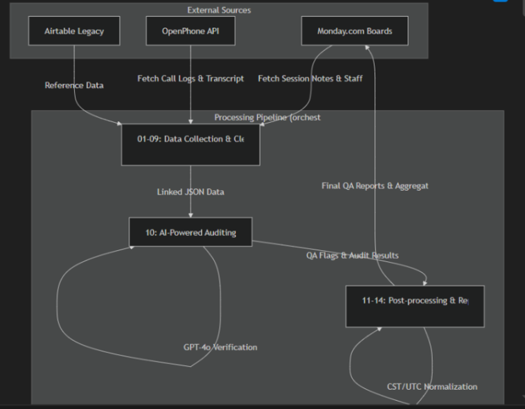
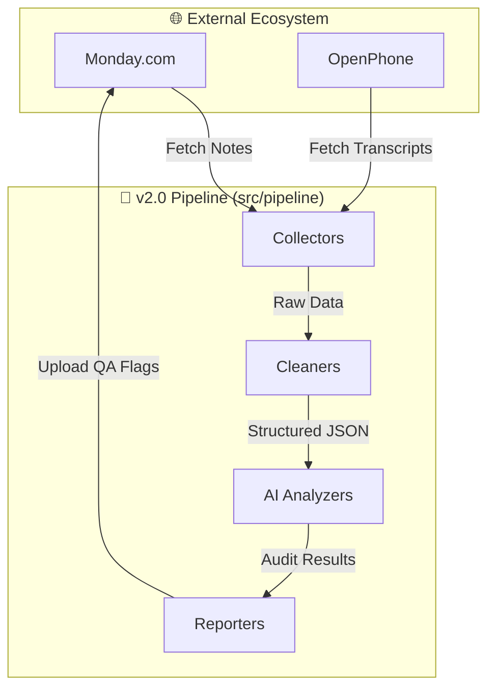

# 🤖 Agentic Employee Tracking & QA System v2.0


A high-performance, AI-powered integration pipeline that synchronizes phone call data between **OpenPhone** and **Monday.com**, performs automated multi-stage QA audits using **GPT-4o**, and generates compliance reports.

---

## 🌟 Key Features

- **🧠 Multi-Stage AI Auditing**: Uses OpenAI's `gpt-4o` with Structured Outputs to verify session start/end times, billing units, and transcript relevance.
- **⚡ High-Performance Pipeline**: Refactored from 20+ scripts into a modular, in-memory system reducing execution time by ~80%.
- **📊 Monday.com Integration**: Automated two-way sync with Monday boards, including real-time flag updates and detailed audit reasons.
- **📞 OpenPhone Synergy**: Fetches and processes call logs and transcripts directly to provide a "single source of truth".
- **🛠 Modular Design**: Clean SoC (Separation of Concerns) with dedicated Collectors, Cleaners, Analyzers, and Reporters.

---

---

## 🏗 System Architecture



### Pipeline Logic Flow


---

## 📁 Folder Structure

```text
📂 Agentic-Employee-Tracking-and-QA
├── 📂 assets/              # Design assets and diagrams
├── 📂 legacy/              # Sanitized procedural scripts (Ref)
│   ├── 📂 ai_audit/        # Legacy AI logic
│   ├── 📂 cleaning/        # Legacy data sanitization
│   └── ...                 # Other legacy modules
├── 📂 src/                 # 🚀 CORE SOURCE CODE
│   ├── 📂 core/            # API Clients & Base Utilities
│   └── 📂 pipeline/        # Modern Modular Pipeline
│       ├── 📄 collectors.py
│       ├── 📄 cleaners.py
│       ├── 📄 ai_analyzers.py
│       └── 📄 reporters.py
├── 📄 main.py              # Central Orchestrator
├── 📄 agent.md             # AI Auditor Specification
├── 📄 README.md            # You are here
└── 📄 CHANGELOG.md         # Version History
```

---

## 🛠 Project Structure

- `main.py`: Central orchestrator and CLI entry point.
- `agent.md`: Comprehensive documentation of the AI Auditor's logic.
- `src/core/`: Robust API clients for Monday.com and OpenPhone.
- `src/pipeline/`:
  - `collectors.py`: All external data fetching (REST/GraphQL).
  - `cleaners.py`: Data normalization (Timezones, Text sanitization).
  - `ai_analyzers.py`: The "Brain" - Multi-prompt AI logic using Pydantic schemas.
  - `reporters.py`: Result propagation back to external systems.

---

## 🚀 Quick Start

### 1. Configure Environment
Create a `.env` file in the root directory:
```env
MONDAY_API_KEY=your_monday_api_key
OPENPHONE_API_KEY=your_openphone_api_key
OPEN_AI_API=your_openai_api_key
```

### 2. Install Requirements
```bash
pip install -r requirements.txt
```

### 3. Run the Pipeline
```bash
# Process notes from the last 16 days
python main.py --days 16
```

---

## 🔐 Core Tech Stack
- **AI**: `OpenAI GPT-4o` (Structured Output mode)
- **Validation**: `Pydantic v2`
- **Data Mgmt**: `JSON` (In-memory)
- **API**: `HTTPX` / `Requests`
- **Time**: `Pytz` (CST -> UTC normalization)

---

## 📄 Documentation
For a deep dive into how the AI Auditor makes decisions, check out [**agent.md**](./agent.md).
